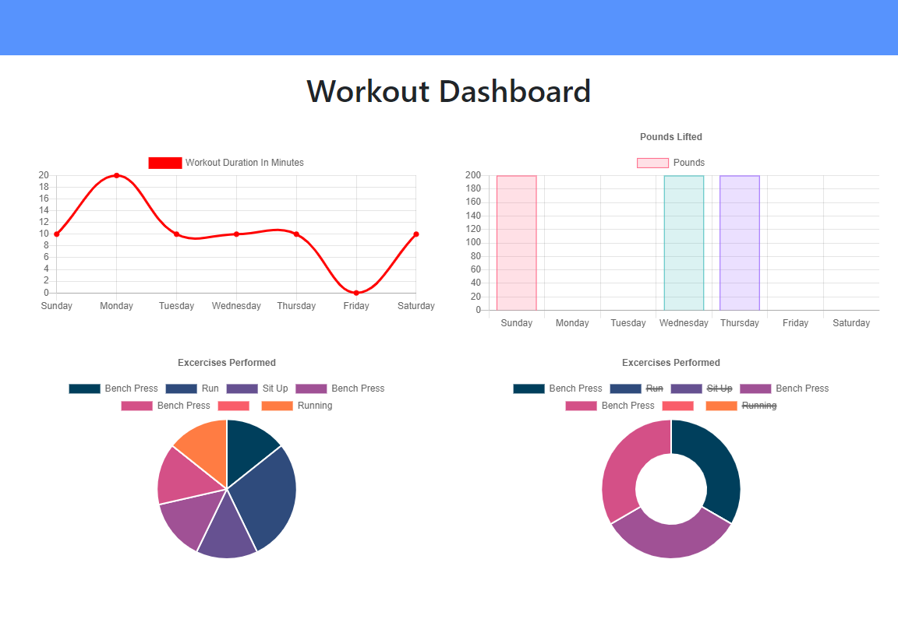

# Workout Tracker    

## Description 
 
This is a workout tracker developed with NodeJS using  Mongo DB with a Mongoose schema and Express route handling. 

## Table of Contents 

* [Usage](#usage-information) 

* [Installation](#installation-instructions) 

* [License](#license) 

* [Where to Contribute](#where-to-contribute) 

* [Tests](#tests) 

* [Repository](#repository) 

* [URL](#url) 

* [Questions](#questions) 

* [Screenshots](#screenshots) 

## Usage Information 
 
    The user will be able to track daily workouts, log resistance and cardio exercises and continue adding exercises to the last workout entered.  

## Installation Instructions 
 
    npm i 

## License 
 
This application is covered under this license: MIT

    
## Where to Contribute 
 
Contributions are possible to the GitHub and Heroku below.  

## Tests 
 
npm run test 

## Repository 
 
This repository is hosted in GitHub and you may access it at [https://github.com/johnsbrook/14_Workout_Tracker](https://github.com/johnsbrook/14_Workout_Tracker). 

## URL 
 
[Workout Tracker](https://workout-tracker-ijzr.herokuapp.com/?id=5f5d672ee60edd0017c5a12e ) 

## Questions 
 
GitHub: [johnsbrook](https://github.com/johnsbrook) 
 
Email: [ivan.zapata.rivera@gmail.com](mailto:ivan.zapata.rivera@gmail.com)

## Screenshot 
 
 
 
